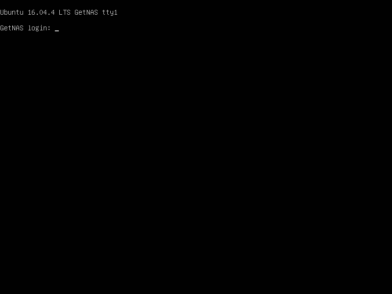
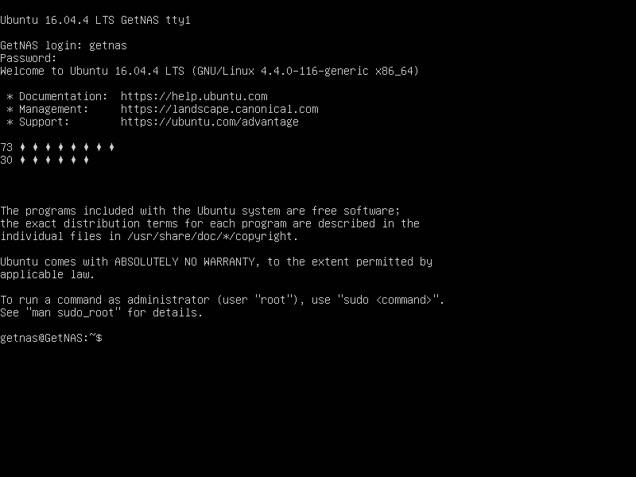

# 第一次启动系统

## 用户登录

初次启动系统，会看到下图所示的登录界面。



在 `GetNAS login:` 提示符下输入用户名 `getnas` 按 `回车` 确认，在 `Password:` 提示符下输入密码。

登录成功后会看到 `~$` 提示符，如果你在系统安装时设置了不同的`用户名`和`主机名`，则提示符`:`前面的字样将与此有所不同。

> 注意：为了避免歧义，本指南将不再使用命令提示符的前缀，即`:`前面的部分。我们会使用 `$` 代表普通用提示符，使用 `#` 代表超级用户提示符。提示符前面的内容代表当前路径，例如 `~$` 代表当前用户的家目录。



## 系统更新

**刷新软件列表**
```shell
~$ sudo apt update
```
> 执行命令时会要求输入密码

**更新软件包**
```shell
~$ sudo apt upgrade
```

> 执行更新命令时会有确认提示 `[Y/n]`，支持按 `回车` 键确认即可。

## 修改更快的软件源

如果你更新软件包的速度较慢，可以用国内的软件源镜像替换官方软件源，这里采用阿里云的镜像举例：

### 备份配置文件

Ubuntu 系统的软件源信息位于 `/etc/apt/sources.list` 文件中，为了防止不当修改产生不可预知的后果，在修改之前应该对其进行备份。

```shell
~$ sudo cp /etc/apt/sources.list /etc/apt/sources.list_bak
```

### 手动修改软件源

使用 `nano` 编辑器打开配置文件：

```shell
~$ sudo nano /etc/apt/sources.list
```

将其中的 `cn.archive.ubuntu.com` 和 `security.ubuntu.com` 均替换成 `mirrors.aliyun.com`。

> `nano` 是 Linux 系统下非常简单易用的一款编辑器，如果你初次使用，可以到网上搜索相关指南。