# 安装 Debian 操作系统

### 引言

本文将指导你使用此前制作的 U 盘系统安装盘，将 Debian 操作系统安装到另外的 U 盘上。

### 先决条件

使用 U 盘系统盘安装操作系统，要求你必须了解如何从 USB 设备引导计算机启动。

通常，是在开机时按下 `F12` 键呼出引导选项菜单。也可能是 `F1 ~ F12` 中的某个按键，请参照你的主板说明书。

系统安装过程需要从互联网下载必须的软件包，因此，在开始前请确认计算机已经接入了互联网。

> 提示：Debian 预置了绝大多数的有线网卡驱动，移除了所有的闭源无线网卡驱动，因此，安装系统时建议使用有线网络连接。

在开始安装系统之前，请为用以构建 NAS 服务器的计算机接好显示器和键盘鼠标。

## 系统安装

### 第一步 从 U 盘安装盘引导启动计算机

将制作好的 U 盘系统安装盘和准备的另一个 8GB 以上容量的空白 U 盘插入用于构建 NAS 服务器的计算机。

开机并设置从 U 盘安装盘引导启动计算机，启动成功后会看到 Debian 系统安装菜单，如下图。

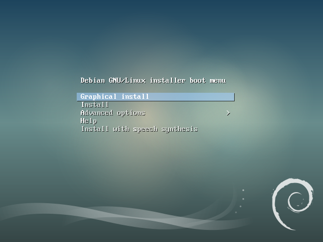

选择菜单中的第一项 `Graphical install`（图形界面安装），按回车确认。这种安装模式支持同时使用键盘和鼠标进行操控。

### 第二步 选择安装语言

点选列表中的 `Chinese (Simplified) - 中文(简体)`，点击 `Continue` 按钮继续。

紧接着会提示安装过程的中文语言包可能不完整，是否使用所选语言继续安装，如下图，点选 `是`，点击 `Continue` 按钮继续。

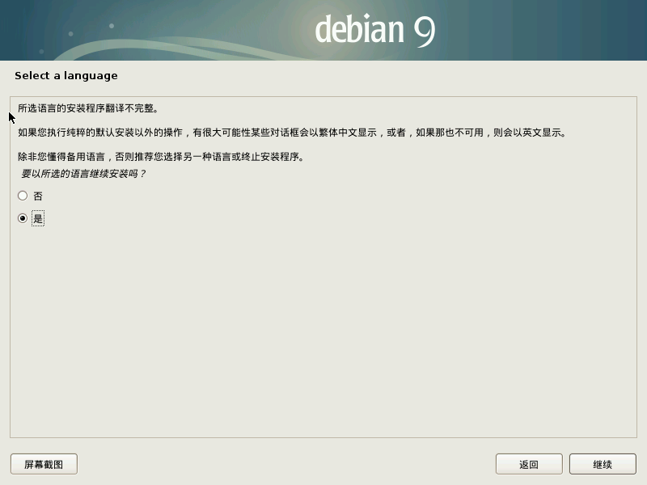

### 第三步 本地化相关设置

**所在区域**：界面对这个步骤提供了明确的介绍，如下图，在列表中点选 `中国`，然后点击 `继续` 按钮。

**键盘**：默认已选中 `汉语`，点击 `继续` 按钮即可。

### 第四步 设置主机名和域名

**主机名**：建议设置一个简单好记的英文单词或字母组合，因为以后需要用主机名和域名访问这台 NAS 服务器，如果你不知道设置什么好，那就设置成 `getnas` 吧。

**域名**：建议将设置为 `local`，这样一来，以后在局域网中就可以用 `getnas.local` 地址访问这台 NAS 服务器了。

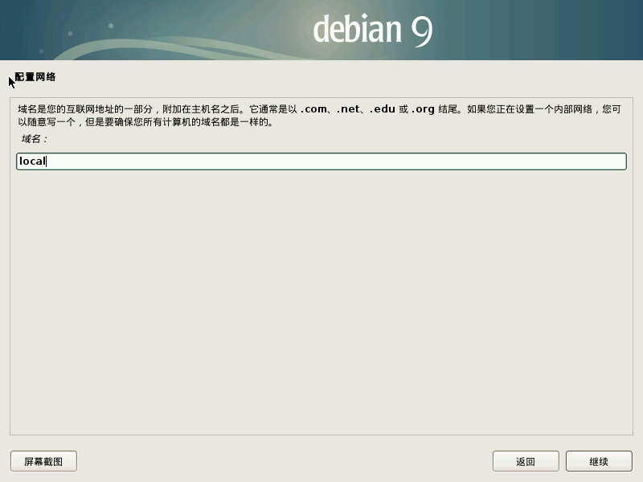

### 第五步 用户和密码

**超级管理员 (root)**：请认真阅读屏幕上的提示信息，出于系统安装考虑，通常不设置 `root` 密码，即不直接使用超级管理员管理系统，而是创建一个普通用户并将其加入到管理组，当需要管理员权限时，通过在命令前添加 `sudo` 或通过使用 `sudo su` 切换到 root 用户身份。

因此，这一步不做设置，点击 `继续` 按钮跳过。

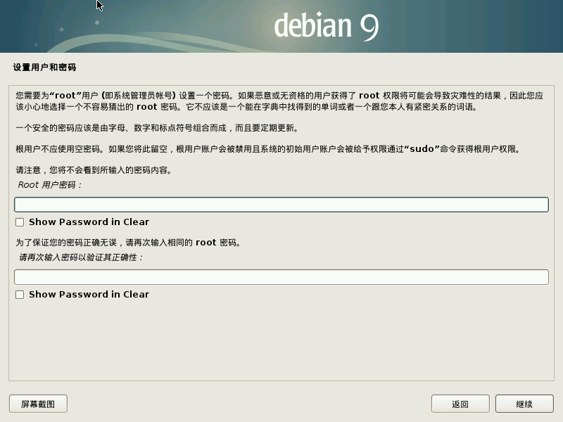

接下来，安装器会引导我们创建一个新的普通用户。

**用户全名**：仅作识别之用，字母大小写均可。

**用户名**：安装器默认将设置的用户全名变成小写设为用户名，你可以按需修改。建议设置短小易记的名称，今后通过 SSH 连接服务器时需要频繁使用这个用户名。

**密码**：为当前正在创建的新用户创建一个密码，密码长度和复杂度没有限制，但建议你设置一个足够复杂的密码。

### 第六步 磁盘分区

由于我们要将 Debian 操作系统安装到 U 盘上，无需复杂设置，直接选择 `向导 - 使用整个磁盘` 这一项即可。

**选择磁盘**：注意不要选错，一定要选择 U 盘，通过设备名称和容量很容易判断。

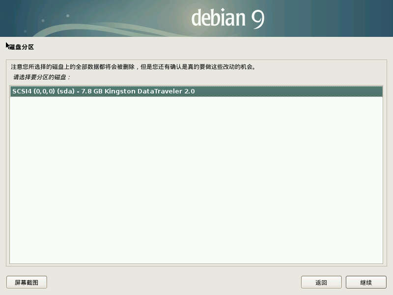

**选择分区方案**：选择 `将所有文件放在同一个分区中（推荐新手使用）` 这一项。

**调整分区**：安装器已经帮助我们自动创建了分区，一个挂载到 `/` 根目录的 ext4 分区，一个 `swap` 交换空间分区，如下图。

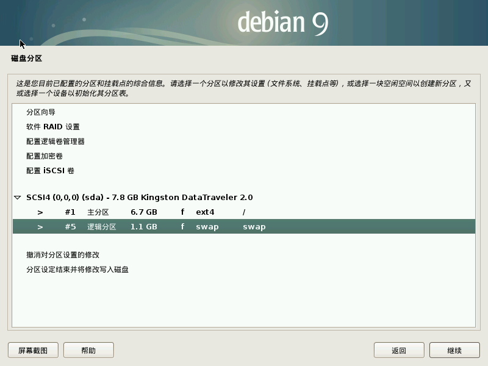

> `Swap 交换空间` 类似于 Windows 中的 `分页文件`，主要作用是当计算机内存不足时，使用硬盘模拟内存，从而避免系统因资源不足导致的无响应或瘫痪等问题。

如今，内存容量越来越大，价格也越来越便宜，计算机很少会出现内存不足的问题。同时，受闪存设备的结构特点制约，在 U 盘上创建 `swap` 分区不但对系统运行速度提升没有任何帮助，还会加速 U 盘损坏。因此，强烈建议删除 `swap` 分区。

**删除 Swap 分区**：

鼠标双击 `swap` 分区那一行记录，如下图，在 swap 分区详情页中点击 `删除此分区`。

最终，你会看到类似下图所示的结果。删除了 swap 分区，U 盘上空闲出了一部分容量，这里我们暂时不用管它。我们会在系统安装完成后，使用 `resize2fs` 命令扩展 `/` 分区容量到最大。

由于我们删除了 swap 分区，安装器会给出提示询问是否返回分区菜单，如下图，选择 `否` 忽略即可。

**操作确认**：选择 `是`，安装器会按照上面的设定，在 U 盘上创建并格式化分区。

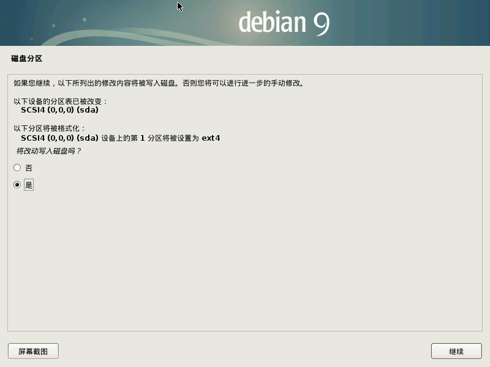

### 第七步 开始安装

**安装介质扫描**：安装过程中，安装器会询问是否扫描其他 CD 介质，选择 `否` 忽略即可。

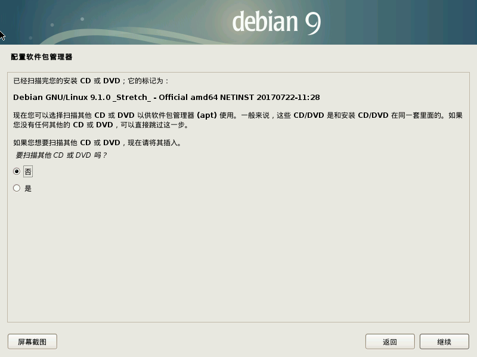

**选择你的位置**：以便于系统能够连接到与你距离较近的软件仓库，选择 `中国`。

**选择镜像仓库**：这一步安装器为我们列出了当前距离我们最近的所有软件源镜像仓库，可以任选一个，系统配置过程中，我们会使用 `netselect-apt` 工具找出速度最快的软件源。

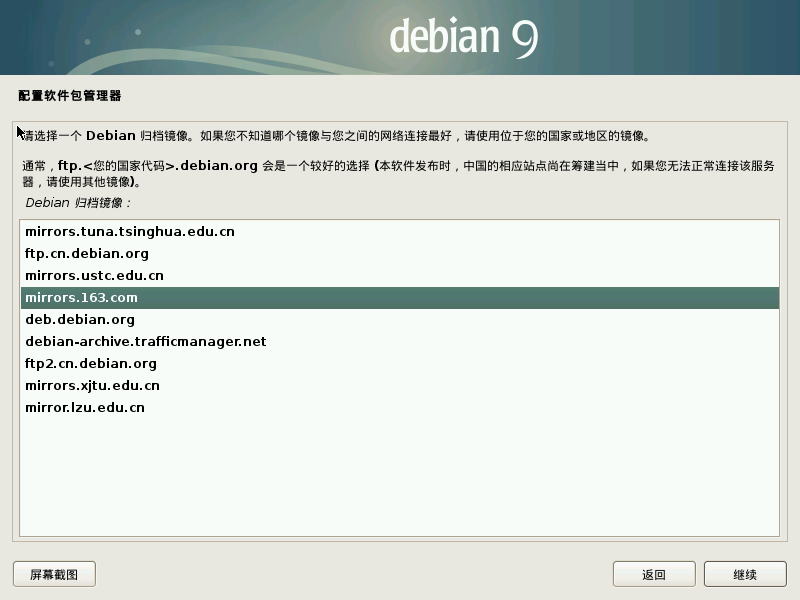

**HTTP 代理服务器**：直接跳过，如果你需要使用 HTTP 代理访问互联网，可能你当前的网络环境并不符合我们的构建要求。

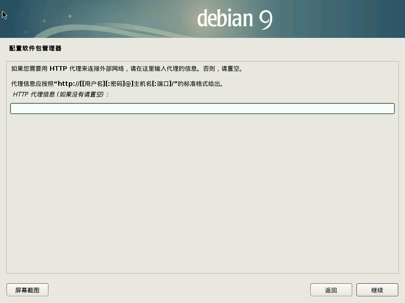

**流行度调查**：选择 `否`，除非你同意让操作系统定期在你的 NAS 上收集一些信息并发送给系统开发者。

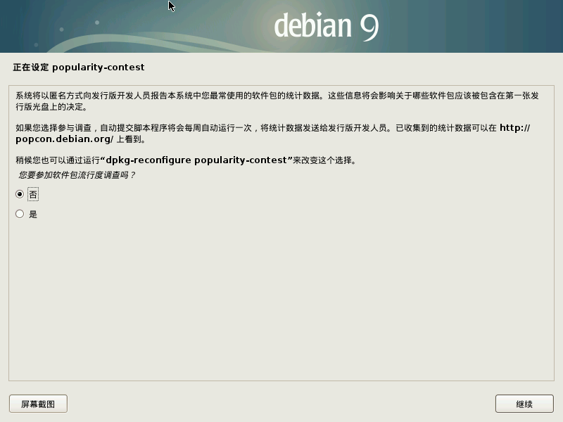

**选择预装软件**：如下图所示，请只选择 `SSH Server` 和 `标准系统工具` 这两项。

**GRUB 安装**：它是操作系统的启动引导器，必须安装它才能正常启动 Debian 系统，选择 `是`。

**GRUB 安装位置**：这里我们需要将 GRUB 安装到 U 盘当中，在列表中选择 U 盘，注意不要选错。

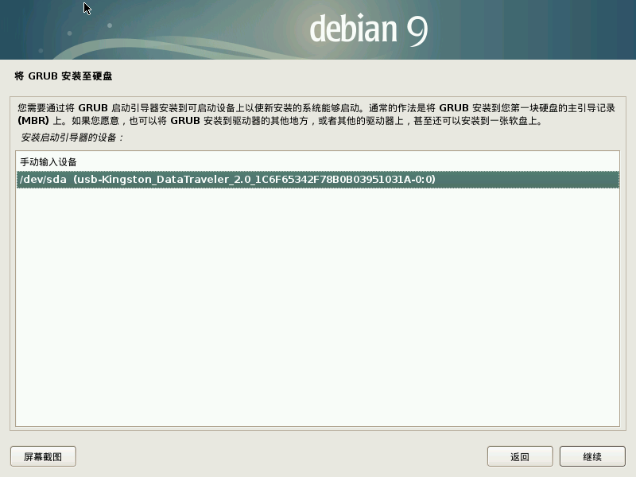

当看到下图所示的界面，表示 Debian 操作系统已经成功的安装到了 U 盘当中。

现在，你可以拔掉 U 盘系统安装盘，只保留安装了 Debian 系统的 U 盘，然后重新启动用计算机。

## 总结

Debian 操作系统的安装虽然步骤很多看似复杂，但只要读者耐心操作一遍，会发现这个过程还是很简单的。实际上，安装过程分为两个部分，前半部分是安装前的配置，后半部分则执行实际的安装。

如果你对安装过程中某个步骤或某项设置不懂或不理解也没有关系，只要按照上面的步骤安装即可，日后你会逐渐了解 Linux 系统的各项功能和设置。

> 注意：在后面的指南中，我们会把 `用以构建 NAS 服务器的计算机` 称为 `NAS 服务器` 或 `NAS 主机`。

现在，NAS 服务器的构建之旅正式开始！